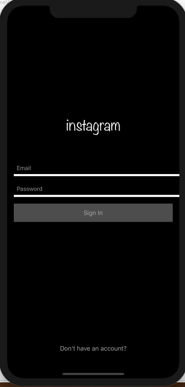
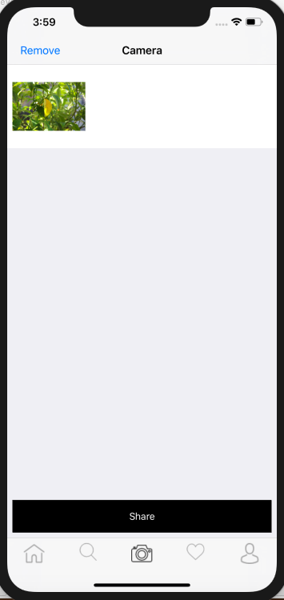

<h1>Instgram Clone</h1>
Live Instgram example is made.

<h2> Externally used library </h2>
<a href = "https://firebase.google.com/">Firebase</a> provides server and dashboard to manage one's own data. 

<h2>Screen Shots</h2>

At Login Page

At Camera Page

